# ALTa Ciencia Abierta 1 2024

- [Meet the attendees!](#meet-the-attendees)
  - [Where do they come from? (n = 109,
    100.0%)](#where-do-they-come-from-n-109-100.0)
  - [What is their educational level? (n = 109,
    100%)](#what-is-their-educational-level-n-109-100)
  - [What is their field of study? (n = 109,
    100%)](#what-is-their-field-of-study-n-109-100)
  - [Do they participate in research projects? (n = 109,
    100%)](#do-they-participate-in-research-projects-n-109-100)
  - [Are they members of groups underrepresented in science? (n = 57,
    52.3%)](#are-they-members-of-groups-underrepresented-in-science-n-57-52.3)
- [Accessibility](#accessibility)
  - [What are their accessibility requirements? (n = 43,
    39.4%)](#what-are-their-accessibility-requirements-n-43-39.4)
- [Background in Open Science](#background-in-open-science)
  - [What is their knowledge about open publishing? (n = 100,
    91.7%)](#what-is-their-knowledge-about-open-publishing-n-100-91.7)
  - [How important do they think open practices are? (n = 95,
    87.2%)](#how-important-do-they-think-open-practices-are-n-95-87.2)
  - [Do they encourage other people to go open? (n = 93,
    85.3%)](#do-they-encourage-other-people-to-go-open-n-93-85.3)
- [Same metrics after the cohort
  finished](#same-metrics-after-the-cohort-finished)
  - [What is their knowledge about open publishing after having
    completed the Cohort training? (n = 32,
    29.4%)](#what-is-their-knowledge-about-open-publishing-after-having-completed-the-cohort-training-n-32-29.4)
  - [How important do they think open practices are after having
    completed the Cohort training? (n = 33,
    30.3%)](#how-important-do-they-think-open-practices-are-after-having-completed-the-cohort-training-n-33-30.3)
  - [Will they encourage other people to go open after having completed
    the Cohort training? (n = 33,
    30.3%)](#will-they-encourage-other-people-to-go-open-after-having-completed-the-cohort-training-n-33-30.3)
- [Zoom attendance](#zoom-attendance)
- [NASA TOPS certification](#nasa-tops-certification)
- [Joined slack](#joined-slack)
- [Net Promoter Score](#net-promoter-score)

## Meet the attendees!

### Where do they come from? (n = 109, 100.0%)

A total of 109 participants signed up from 13 countries, 51.4% (n = 56)
from Argentina, followed by 20.2% (n = 22) from Colombia and 11.9% (n =
13) from Ecuador. The remaining 16.3% (n = 18) were from Mexico, Chile,
Venezuela, Bolivia, Brazil, Costa Rica, Cuba, Czech Republic, Peru,
United States.

#### Figure 1. Country of residence of the people that signed up

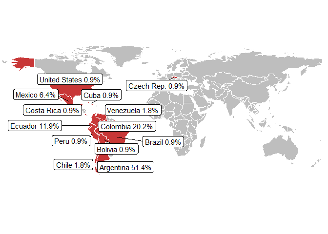

#### Figure 2. Country of residence of the people that signed up

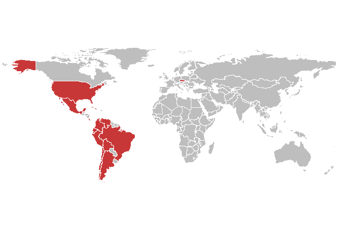

#### Figure 3. Country of residence of the people that signed up

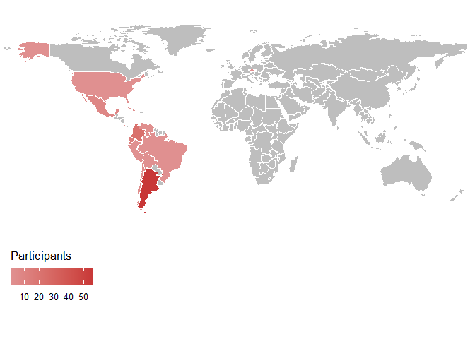

<table>
<colgroup>
<col style="width: 50%" />
<col style="width: 50%" />
</colgroup>
<tbody>
<tr class="odd">
<td style="text-align: center;">

<h4 id="figure-4.-pronouns-used-by-the-people-that-signed-up">Figure 4.
Pronouns used by the people that signed up</h4>

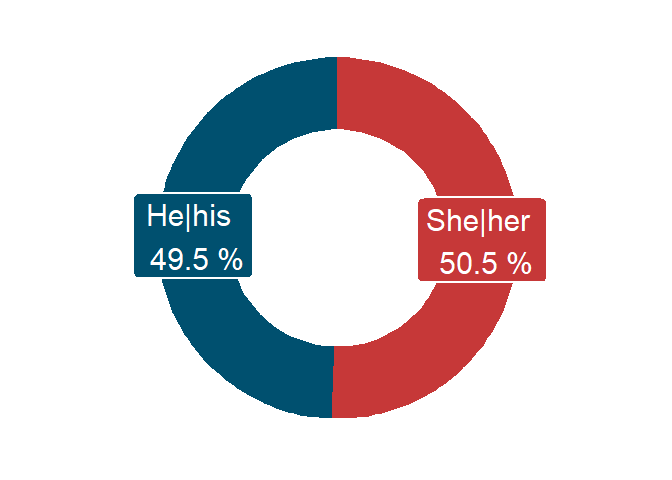

</td>
<td style="text-align: center;">

<h3 id="which-pronouns-do-they-use-n-109-100">Which pronouns do they
use? (n = 109, 100%)</h3>

Out of the 109 participants, 49.5% (n = 54) use the pronouns
He|his.

</td>
</tr>
</tbody>
</table>

<table>
<colgroup>
<col style="width: 50%" />
<col style="width: 50%" />
</colgroup>
<tbody>
<tr class="odd">
<td style="text-align: center;">

<h4 id="figure-5.-people-that-signed-up-as-part-of-a-team.">Figure 5.
People that signed up as part of a team.</h4>

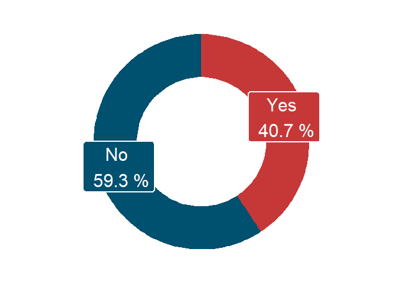

</td>
<td style="text-align: center;">

<h3 id="are-they-attending-as-part-of-a-team-n-108-99.1">Are they
attending as part of a team? (n = 108, 99.1%)</h3>

Out of the 108 participants who answered this question, 40.7% (n =
44) joined as part of a team.

</td>
</tr>
</tbody>
</table>

### What is their educational level? (n = 109, 100%)

Almost two-thirds of the participants (74.3%, n = 81) of the
participants have an undergraduate degree, 43.1% (n = 47) has
additionally completed postgraduate courses. Finally, 8.3% (n = 9)
completed high school and 17.4% (n = 19) has taken or is currently
taking university courses.

#### Figure 6. Educational level of the people that signed up

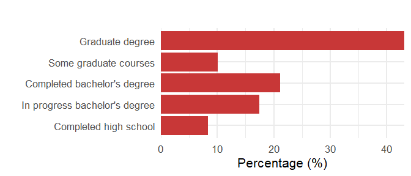

### What is their field of study? (n = 109, 100%)

We have attendees from 8 different fields of study. The 33.9% (n = 37)
corresponds to Exact and Natural Sciences, followed by a 27.5% (n = 30)
corresponding to Engineering and a 22% (n = 24) to Social Sciences. The
remaining 16.5% (n = 18) are people of the following fields: Health
Sciences, Humanities, Technology and Architecture, Data Science and
Analysis, Managerial Information Management.

#### Figure 7. Field of study of the people that signed up

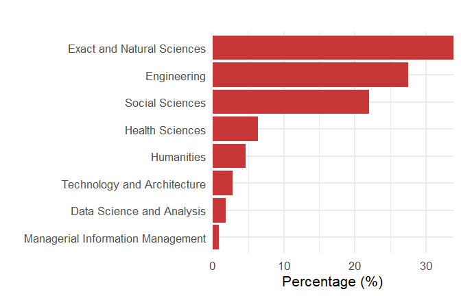

### Do they participate in research projects? (n = 109, 100%)

Out of the people who signed up, 76.9% (n = 83) participates in research
projects. Of those participants, 50% (n = 54) have between 0 and 5 years
of experience. Those who participate in research (76.9%, n = 83) have an
average of 7.6 (sd = 6.8, IC = 6.1, 9.0) years of experience. A small
group of them (10.8%, n = 9) has more than 20 years of experience.

<table>
<colgroup>
<col style="width: 50%" />
<col style="width: 50%" />
</colgroup>
<tbody>
<tr class="odd">
<td style="text-align: center;">

<h4
id="figure-8.-percentage-of-the-people-that-signed-up-that-participate-in-research-projects.">Figure
8. Percentage of the people that signed up that participate in research
projects.</h4>

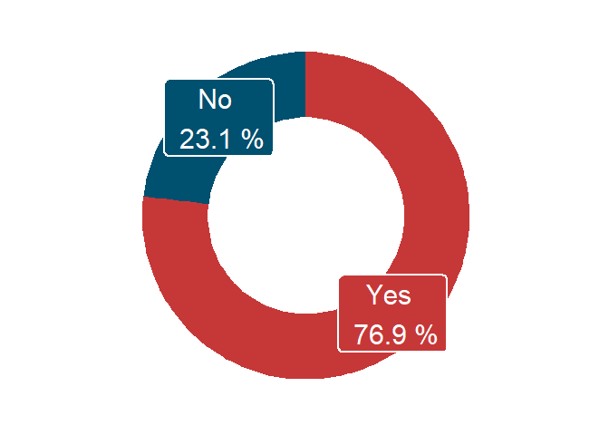

</td>
<td style="text-align: center;">

<h4
id="figure-9.-years-of-experience-in-research-for-the-people-that-participate-in-a-research-project.">Figure
9. Years of experience in research for the people that participate in a
research project.</h4>

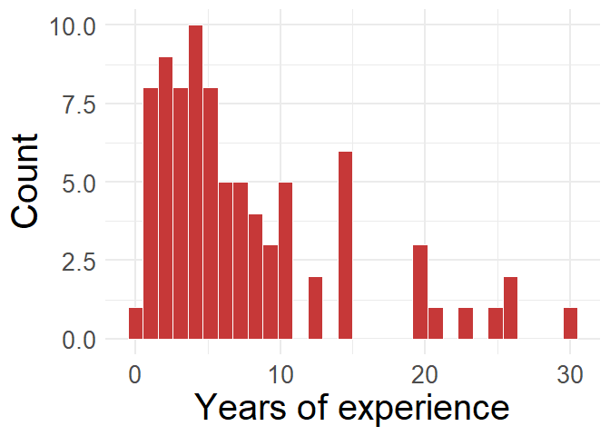

</td>
</tr>
</tbody>
</table>

### Are they members of groups underrepresented in science? (n = 57, 52.3%)

Among the 57 persons (52.3%) who answered this question, 48.4% (n = 31)
belongs to the category women and minority genders, the 37.5% (n = 24)
belongs to people from disadvantaged socioeconomic backgrounds and the
6.2% (n = 4) to indigenous peoples. The remaining 7.8% (n = 5) identify
as belonging to the following groups: people with disabilities,
afro-descendant population, university administrative staff.

#### Figure 10. Underrepresented groups in technical and scientific contexts that participants identify with.

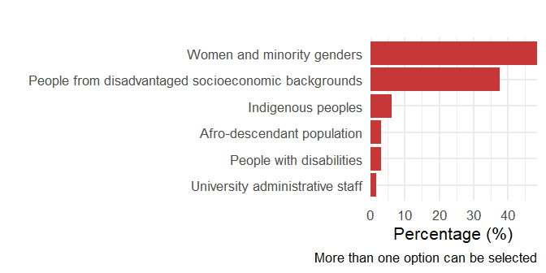

The total percentage exceeds 100% because participants were asked to
choose all the categories that could represent their intersectionalities
of underrepresentation in science.

## Accessibility

### What are their accessibility requirements? (n = 43, 39.4%)

This question was completed by 43 persons, a 39.4% of the total of
participants. Among those who answered, the biggest request is record
and sharing the video (76.7%, n = 33), followed by speak with a clear
and calm voice (14.0%, n = 6). The remaining 4.7% (n = 2) corresponds to
people that requested: have a stable internet connection, provide live
captions.

#### Figure 11. Accessibility requirements by participants.

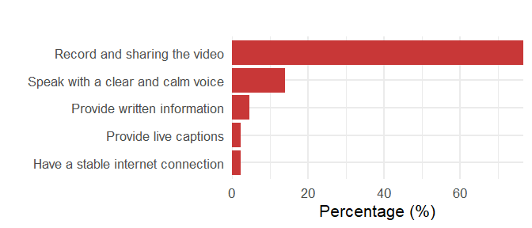

The total percentage exceeds 100% because participants were asked to
choose all the categories that could represent their intersectionalities
of underrepresentation in science.

## Background in Open Science

### What is their knowledge about open publishing? (n = 100, 91.7%)

A total of 100 participants (91.7%) answered a question regarding the
practice of openly publishing various products of the research process.
Nevertheless, not every one completed every item:

| Open practice                   | N responses |
|:--------------------------------|------------:|
| Code                            |          94 |
| Data collected                  |          98 |
| Hypothesis and analysis plan    |          98 |
| Instruments                     |          97 |
| Data management plan            |          97 |
| Pre-register a research project |          98 |
| Results in Open Access journals |          94 |
| Results in alternative media    |          96 |

Table 1. Number of participants that answered regarding each open
product.

We can observed that:

- The most well-known practice was data collected (31.6% - n = 31 - of
  the participants mentioned knowing this practice, while 60.2% - n =
  59 - had already applied it).

- The least known practices were data management plan, hypothesis and
  analysis plan, code with 22.7% (n = 22), 22.4% (n = 22), 22.3% (n
  = 21) respectively.

- Each of the listed practices were known by at least 77.3% of the
  participants (n = 73), and used by more than a 39.8% (n = 39).

#### Figure 12. Participants’ knowledge regarding various Open Science practices.

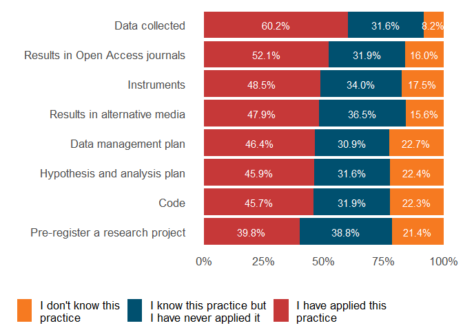

### How important do they think open practices are? (n = 95, 87.2%)

The practice identified as very important most often was “Publish
results in Open Access journals” (66.3%, n = 63), while the practice
that more people considered of little or no importance was “Publish
instruments” (5.4%, n = 5).

#### Figure 13. Levels of importance assigned to various Open Science practices by participants.

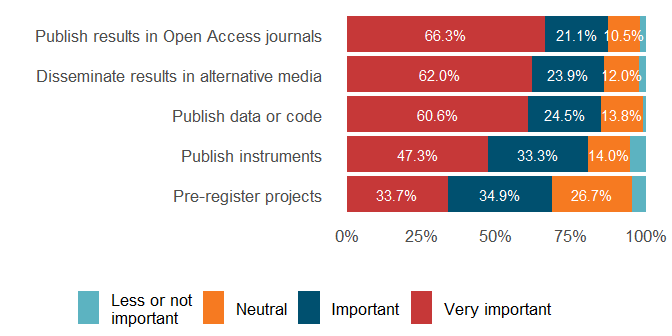

### Do they encourage other people to go open? (n = 93, 85.3%)

We asked participants if they encourage other professionals,
researchers, their coworkers, and/or their thesis students or advisors
to implement various open practices. Out of the total of people who
answered this question, more than 50% encourages their colleagues and
thesis students to share results in alternative media, publish results
in open access journals, publish data or code in open repositories
(67.7% - n = 63, 65.6% - n = 61, 61.3% - n = 57%, respectively). In
agreement with answers to the previous question, the practice they
reported to incentivize the least was pre-register their projects
(25.8%, n = 24).

#### Figure 14. Open practices the participants encourage others to implement.

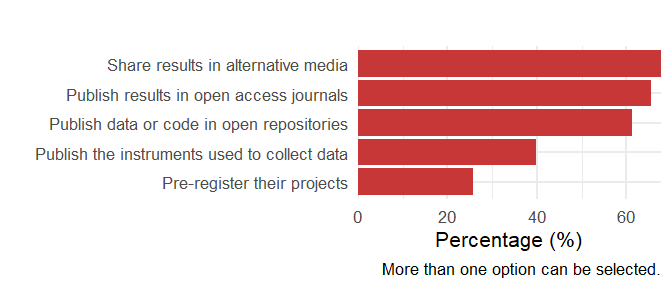

The total percentage exceeds 100% because participants were asked to
choose all the practices they encourage others to implement.

## Same metrics after the cohort finished

The final survey was completed by 33 participants (30.3% of the people
that signed up and 50.0% of the people that attendeed the zoom
meetings).

### What is their knowledge about open publishing after having completed the Cohort training? (n = 32, 29.4%)

A total of 32 participants (29.4%) answered a question regarding the
practice of openly publishing various products of the research process.
Nevertheless, not every one completed every item:

| Open practice                   | N responses |
|:--------------------------------|------------:|
| Code                            |          30 |
| Data collected                  |          31 |
| Hypothesis and analysis plan    |          31 |
| Instruments                     |          31 |
| Data management plan            |          32 |
| Pre-register a research project |          32 |
| Results in Open Access journals |          32 |
| Results in alternative media    |          31 |

Table 1. Number of participants that answered regarding each open
product.

We can observed that:

- The most well-known practice was data collected (38.7% - n = 13 - of
  the participants mentioned knowing this practice, while 51.6% - n =
  16 - had already applied it).

- The least known practices were code, data collected, results in open
  access journals with 13.3% (n = 4), 9.7% (n = 3), 9.4% (n = 3)
  respectively.

- Each of the listed practices were known by at least 86.7% of the
  participants (n = 26), and used by more than a 21.9% (n = 7).

#### Figure 15. Participants’ knowledge regarding various Open Science practices after completing the Cohort training.

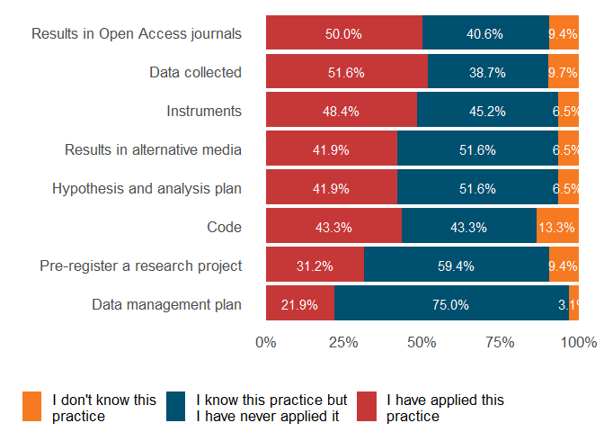

### How important do they think open practices are after having completed the Cohort training? (n = 33, 30.3%)

The practice identified as very important most often was “Publish
results in Open Access journals” (83.9%, n = 26), while the practice
that more people considered of little or no importance was “Pre-register
projects” (9.4%, n = 3).

#### Figure 16. Levels of importance assigned to various Open Science practices by participants.

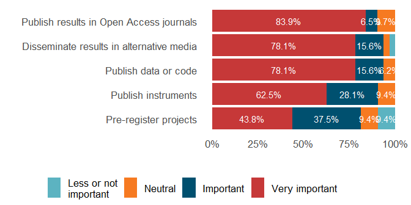

### Will they encourage other people to go open after having completed the Cohort training? (n = 33, 30.3%)

We asked participants if after having participated in the Cohort they
will encourage other professionals, researchers, their coworkers, and/or
their thesis students or advisors to implement various open practices.
Out of the total of people who answered this question, more than 50%
states that they will encourage their colleagues and thesis students to
publish data or code in open repositories, share results in alternative
media, publish results in open access journals, publish the instruments
used to collect data, pre-register their projects (87.9% - n = 29,
84.8% - n = 28, 84.8% - n = 28, 78.8% - n = 26, 57.6% - n = 19%,
respectively). In agreement with answers to the previous question, the
practice they they consider they will incentivize the least is
pre-register their projects (57.6%, n = 19).

#### Figure 17. Open practices the participants will encourage others to implement.

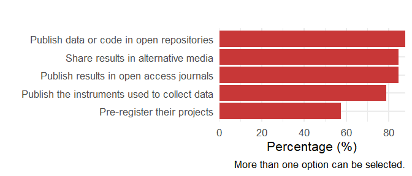

The total percentage exceeds 100% because participants were asked to
choose all the practices they encourage others to implement.

## Zoom attendance

Out of the 109 people who signed up for the cohort, 66 (60.6%) attended
the Zoom meetings at least once over the 6 synchronous sessions.

| Meeting                                                                                             |   N |    % |
|:----------------------------------------------------------------------------------------------------|----:|-----:|
| 1                                                                                                   |  52 | 47.7 |
| 2                                                                                                   |  39 | 35.8 |
| 3                                                                                                   |  38 | 34.9 |
| 4                                                                                                   |  36 | 33.0 |
| 5                                                                                                   |  31 | 28.4 |
| 6                                                                                                   |  36 | 33.0 |
| a Note. N = number of attendees; % = percentage of attendees over total of participants. |     |      |

Table 1. Number of participants that attendeed each meeting.

The mean number of attendees per meeting was 38.7 (SD = 7.1, CI 95% =
33.0, 44.3).

| Meeting                                                                                                                        | Remained until the end |    % |
|:-------------------------------------------------------------------------------------------------------------------------------|-----------------------:|-----:|
| 1                                                                                                                              |                     40 | 76.9 |
| 2                                                                                                                              |                     28 | 71.8 |
| 3                                                                                                                              |                     31 | 81.6 |
| 4                                                                                                                              |                     28 | 77.8 |
| 5                                                                                                                              |                     23 | 74.2 |
| 6                                                                                                                              |                     23 | 63.9 |
| a Note. N = number of attendees that remained until the end of the meeting; % = percentage over total of attendees. |                        |      |

Table 2. Number of participants that attendeed each meeting.

A mean of 74.4% of the attendees remained connected until the end of the
meetings. Over the 6 meetings, the mean connection time was of 2 hours
and 25 minutes, (SD = 55 minutes, CI 95% = 2 hours and 18 minutes, 2
hours and 32 minutes), a 80.6% of the mean connection time that the
sessions lasted on average 3 hours.

#### Figure 18. Number of participants that attendeed each meeting and remained until the end of the session.

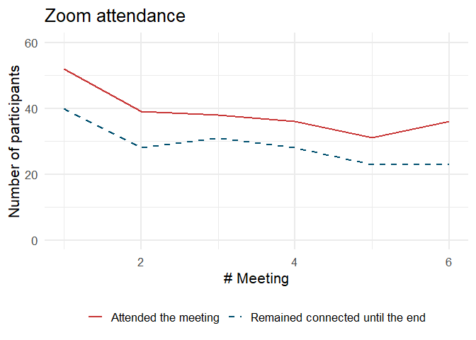

## NASA TOPS certification

Out of the 109 people who signed up, 52 (47.7%) completed at least one
of the assessment forms and 43 (39.4%) completed all required
assessments to get certified by NASA.

#### Figure 19. Number of participants that approved the assessment form.

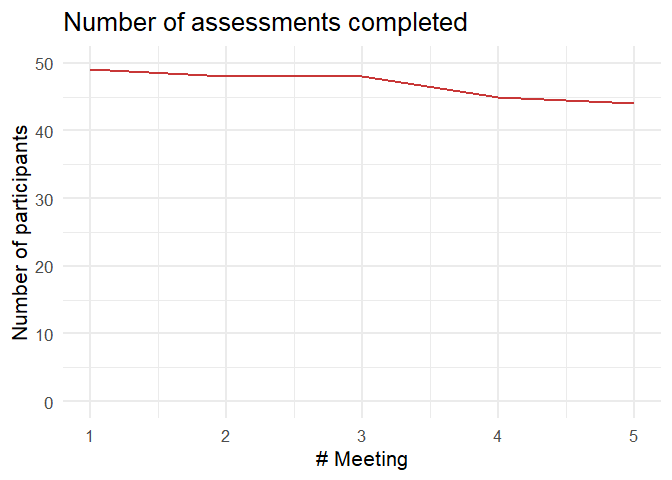

## Joined slack

Out of the 109 people who signed up for this first cohort, 51 (46.8%)
joined our Slack community! Welcome new members!

## Net Promoter Score

The Net Promoter Score (NPS) (Reichheld, 2003) is a widely used metric
that measures customer loyalty and satisfaction. It is calculated by
asking respondents a single question: “How likely are you to recommend
this course to a friend or colleague?” Responses are given on a scale
from 0 to 10, where 0 means “Not at all likely” and 10 means “Extremely
likely”. Based on their responses, customers are categorized into three
groups: Promoters (scores of 9-10), Passives (scores of 7-8), and
Detractors (scores of 0-6). The NPS is determined by subtracting the
percentage of Detractors from the percentage of Promoters. The resulting
score can range from -100 to +100, with a higher score indicating
greater customer satisfaction and loyalty.

[Suggested cutoff
values](https://www.qualtrics.com/en-gb/experience-management/customer/good-net-promoter-score/?rid=ip&prevsite=en&newsite=uk&geo=GB&geomatch=uk)
are:

- Above 0 is good,
- Above 20 is favorable,
- Above 50 is excellent, and
- Above 80 is world class.

Based on the 32 participants that responded to this question in the
final survey (48.5% of attendees), an **NPS of 71.9%** was obtained,
which is considered excellent. This score reflects a high level of
satisfaction and loyalty among the respondents, indicating that they are
likely to recommend our course to others.

Reichheld, F. F. (2003). The one number you need to grow. Harvard
business review, 81(12), 46-55.
