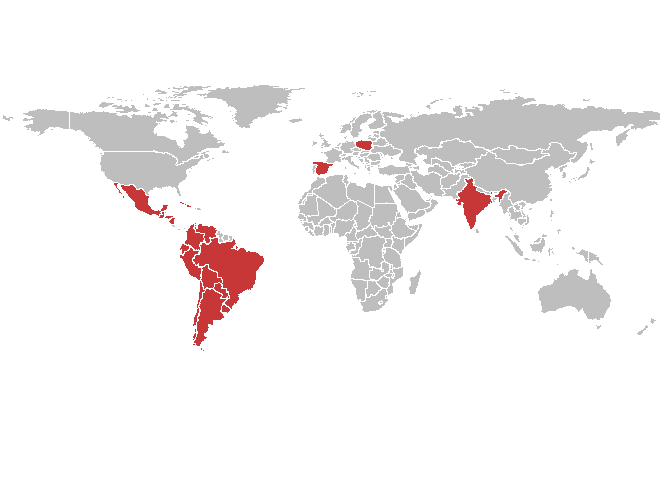
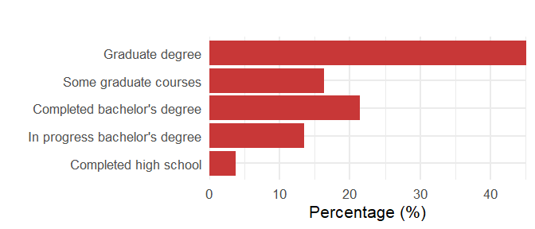
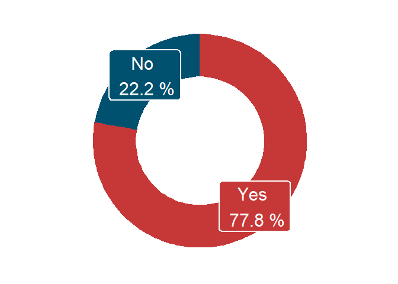
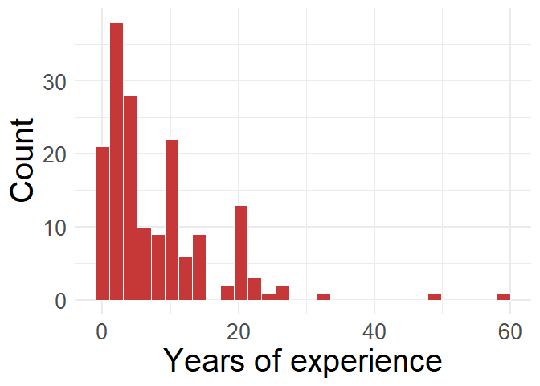
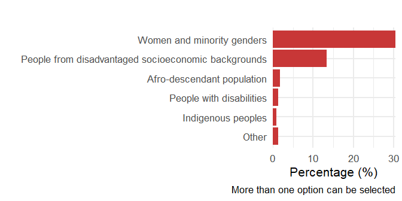
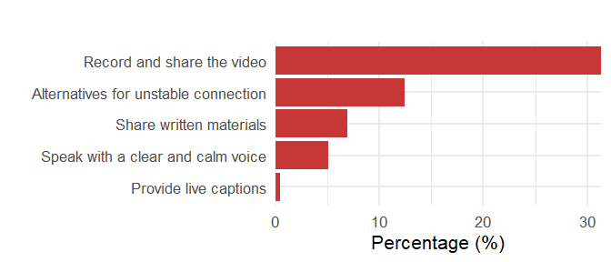
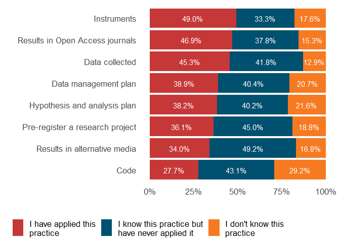
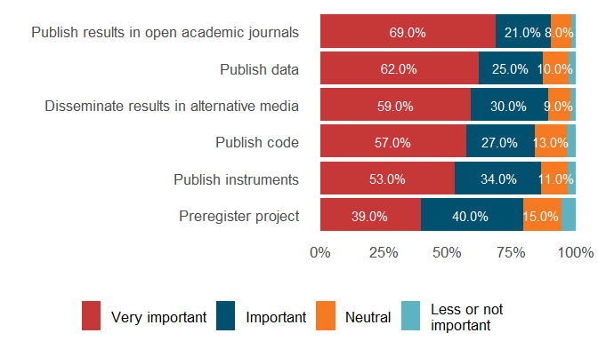
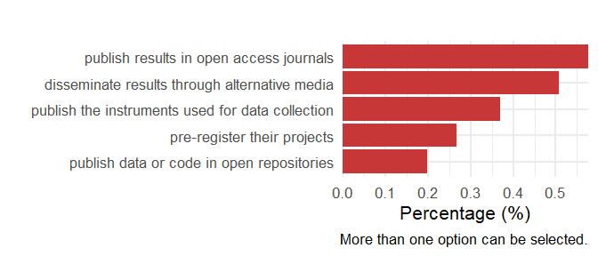

# ALTa Ciencia Abierta

- [Meet the attendees!](#meet-the-attendees)
  - [Where do they come from? (n = 215,
    99.1%)](#where-do-they-come-from-n--215-991)
  - [What is their educational level? (n = 215,
    99.1%)](#what-is-their-educational-level-n--215-991)
  - [What is their field of study? (n = 217,
    100%)](#what-is-their-field-of-study-n--217-100)
  - [Do they participate in research projects? (n = 216,
    99.5%)](#do-they-participate-in-research-projects-n--216-995)
  - [Are they members of groups underrepresented in science? (n = 107,
    49.3%)](#are-they-members-of-groups-underrepresented-in-science-n--107-493)
- [Accessibility](#accessibility)
  - [What are their accessibility requirements? (n = 122,
    56.2%)](#what-are-their-accessibility-requirements-n--122-562)
- [Background in Open Science before attending ALTa Ciencia Abierta 1
  2024](#background-in-open-science-before-attending-alta-ciencia-abierta-1-2024)
  - [What is their knowledge about open publishing? (n = 206,
    94.9%)](#what-is-their-knowledge-about-open-publishing-n--206-949)
  - [How important do they think open practices are? (n = 204,
    94%)](#how-important-do-they-think-open-practices-are-n--204-94)
  - [Do they encourage other people to practice open science? (n = 175,
    80.6%)](#do-they-encourage-other-people-to-practice-open-science-n--175-806)
  - [Final remarks](#final-remarks)

This report presents an overview of the participants who attended ALTa
Ciencia Abierta, the Latin American contextualization of NASA’s Open
Science 101 course, in 2024. It offers a snapshot of their backgrounds,
representation, accessibility needs, and prior knowledge and attitudes
toward Open Science practices. The findings aim to inform future
iterations of the program and contribute to the ongoing development of
inclusive, community-driven training in the region.

*Note: The following report is created based on the responses of
participants that signed an informed consent to publish their data. This
data correspond to a 44% of the actual participants.*

## Meet the attendees!

### Where do they come from? (n = 215, 99.1%)

A total of 217 participants signed up from 19 countries, 43.26% (n = 93)
from Argentina, followed by 10.23% (n = 22) from Ecuador and 9.77% (n =
21) from Mexico. The remaining 36.79% (n = 79) were from Bolivia,
Colombia, Peru, Venezuela, Chile, El Salvador, Paraguay, Brazil, Cuba,
Uruguay, Nicaragua, Spain, Guatemala, Honduras, India and Poland.

#### Figure 1. Country of residence of the people who signed up

### What is their educational level? (n = 215, 99.1%)

A 45.1% (n = 97) has completed a graduate degree, 16.3% (n = 35)
completed some graduate courses, 13.5% (n = 29) completed a bachelor
degree, 21.4% (n = 46) has taken or is currently taking undergraduate
courses and 3.7% (n = 8) completed high school.

#### Figure 2. Educational level of the people who signed up

### What is their field of study? (n = 217, 100%)

We have attendees from 6 different fields of study. A 25.3% (n = 55)
correspond to Exact and Natural Sciences, followed by a 24% (n = 52)
corresponding to Social Sciences and a 22.6% (n = 49) to Engineering,
Technology and Architecture. The remaining 28.1% (n = 61) are people
from the following fields: Health Sciences, Humanities, Other.

#### Figure 3. Field of study of the people who signed up

### Do they participate in research projects? (n = 216, 99.5%)

Out of the people who signed up, 77.8% (n = 168) participates in
research projects. Of those participants, 50% (n = 1) have less than 5
years of experience. Those who participate in research (77.8%, n = 168)
have an average of 8.3 (sd = 8.4, IC = 7.0, 9.6) years of experience. A
small group of them (13.1%, n = 22) has more than 20 years of
experience.

#### Figure 4. Percentage of the people who signed up who participate in research projects.

#### Figure 5. Years of experience in research for the people who participate in a research project.

### Are they members of groups underrepresented in science? (n = 107, 49.3%)

Among the 107 persons (49.3%) who answered this question, 61.7% (n = 66)
are women or belong to other minoritized genders and the 27.1% (n = 29)
are from disadvantaged socioeconomic backgrounds. The remaining groups
are people that identify as afro-descendant population, people with
disabilities, indigenous people, and others (less than 2% each).

#### Figure 6. Underrepresented groups in technical and scientific contexts with which participants identify.

The total percentage exceeded 100% because participants were asked to
choose all the categories that could represent their intersectionalities
of underrepresentation in science.

## Accessibility

### What are their accessibility requirements? (n = 122, 56.2%)

This question was completed by 122 people, 56.2% of all registered
participants. Among those who answered, the most frequent request is
“Record and share the video” (31.3%, n = 68), followed by Alternatives
for unstable connection (12.4%, n = 27). The remaining 12.4% (n = 27)
corresponds to people who requested Speak with a clear and calm voiceand
Provide live captions.

#### Figure 7. Accessibility requirements by participants.

## Background in Open Science before attending ALTa Ciencia Abierta 1 2024

### What is their knowledge about open publishing? (n = 206, 94.9%)

A total of 206 participants (94.9%) answered questions regarding the
practice of openly publishing various products of their research
process. Not everyone answered this question for all research products.
Table 1 details the number of answers for each product.

| Open practice                   | N responses |
|:--------------------------------|------------:|
| Code                            |         195 |
| Data collected                  |         201 |
| Hypothesis and analysis plan    |         199 |
| Instruments                     |         204 |
| Data management plan            |         198 |
| Pre-register a research project |         202 |
| Results in Open Access journals |         196 |
| Results in alternative media    |         197 |

Table 1. Number of participants that answered regarding each open
product.

Figure 12 shows that:

- The most well-known practice was openly publishing the instruments
  (33.3% - n = 68 of the participants mentioned knowing this practice,
  while 49.0% - n = 100 - had already applied it).

- The least known practices were openly publishing the code, hypothesis
  and analysis plan, data management plan and pre-registration, each
  with less than 29.2% (n = 57), 21.6% (n = 43), 20.7% (n = 41)
  respectively.

#### Figure 8. Participants’ knowledge regarding various Open Science practices.

### How important do they think open practices are? (n = 204, 94%)

The practice identified as very important most often was “Publish
results in open academic journals” (68.9%, n = 135), while the practice
that most people considered of little to no importance was “Preregister
project” (5.4%, n = 10).

#### Figure 9. Levels of importance assigned to various Open Science practices by participants.

### Do they encourage other people to practice open science? (n = 175, 80.6%)

We asked participants if they encouraged other professionals,
researchers, their coworkers, or their students or advisees to implement
various open practices. Resultas show than more than 50% of respondants,
incentivize others to publish results in open access journals and
disseminate them through alternative media, such as social media,
blogposts, etc. While the practice they report encouraging the less is
publishing data or code openly.

#### Figure 10. Open practices the participants encourage others to implement.

The total percentage exceeded 100% because participants were asked to
choose all the practices they encouraged others to implement.

### Final remarks

The data collected from participants of ALTa Ciencia Abierta 2024 offers
a valuable snapshot of the current landscape of researchers and
technical staff engaging with Open Science in Latin America. With
representation from 19 countries, a wide range of academic backgrounds,
and diverse levels of experience in research, this community exemplifies
both the richness and the heterogeneity of the region’s scientific
ecosystem.

Out of all participats conducting research, almost half identify as
belonging to one or more underrepresented groups in science. This
reinforces the importance of designing inclusive training spaces that
recognize and support intersectional identities and trajectories.

The results also show that while there is strong appreciation for Open
Science values, especially in regard to publishing research results in
open journals and sharing through alternative media, certain practices
such as preregistration, data management planning, and code sharing
remain less familiar or less commonly adopted. This gap highlights the
need for further training, mentoring, and community-building efforts to
lower the barriers to implementation and foster a culture of openness
that is both robust and context-sensitive.

As we move forward, this baseline information will help guide the
adaptation of future training materials and the development of targeted
support strategies that align with the realities of Latin American
researchers. In this way, ALTa Ciencia Abierta continues to contribute
to a more inclusive, equitable, and collaborative scientific future.
