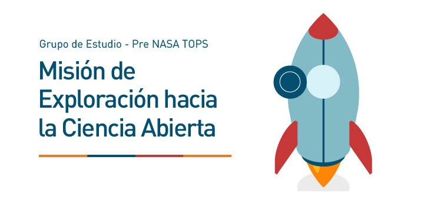

# Exploration Mission toward Open Science

## Group Introduction to NASA TOPS Content

In 2024, we will begin teaching principles of Open Science in Spanish through several-week virtual cohorts. To prepare, we invited all members of the MetaDocencia community to study together the original course content in English from the [Open Science 101 course](https://openscience101.org/), part of the Transform to Open Science (TOPS) initiative organized by NASA.

We conducted several meetings where we reviewed different topics that make up the world of Open Science: its core ideas, the most frequent tools, how to handle open data and code, and much more. We incorporated a local perspective, considering situations and examples from our experiences in Latin America.

This document aims to present information about the participants and the feedback we received from them to analyze the impact, reach, and possibilities for improvement of this activity.

All individuals who participate and contribute to this repository must adhere to our [community guidelines](https://www.metadocencia.org/en/pdc/) and follow these [contribution guide](https://github.com/MetaDocencia/docs/blob/master/CONTRIBUIR.md) on how and where to collaborate with MetaDocencia.

You can download the final report as an HTML file. You can find the code we used in this repository but with dummy databases to protect the participants privacy and data.  

### License

All our materials follow this [license](https://github.com/MetaDocencia/docs/blob/master/LICENCIA.md).
